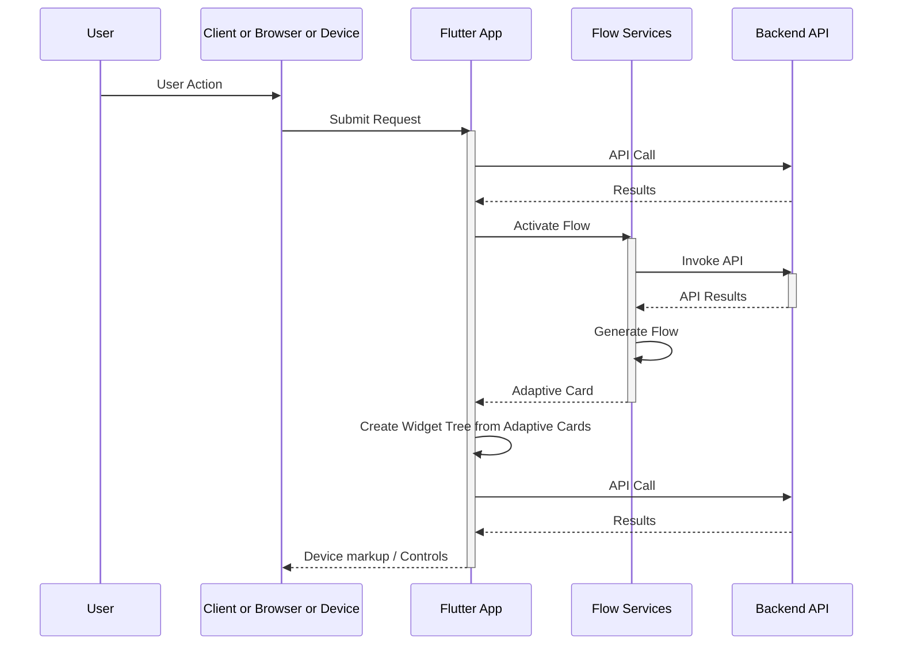

# Adaptive Cards in Flutter

This is an Adaptive Card implementation for Flutter that has been been updated from the original by others. They did amazing work. No one appears to be doing PRs to bring it back to the original so I'm just listing the forking history below.


* [Adaptive Cards website](https://adaptivecards.io/)
* [Adaptive Cards Schema Docs](https://adaptivecards.io/explorer)
* [The main GitHub repo with samples](https://github.com/microsoft/AdaptiveCards)
  * [The v1.5 samples on the main GitHub repo](https://github.com/microsoft/AdaptiveCards/tree/main/samples/v1.5/Scenarios)
  * [Template samples. Templates are not supported in this library](https://github.com/microsoft/AdaptiveCards/tree/main/samples/Templates/Scenarios)
* [Description of Active Cards]( https://github.com/MicrosoftDocs/AdaptiveCards)
* [Another example repo containing samples/templates](https://github.com/pnp/AdaptiveCards-Templates)

Teams often create a flow management layer in front of the core business services. The cannonical flow would be



## Example Execution

There is an expansive example program that demonstrates all Adaptive Cards. See [example README.md](example/README.md)

## Tests

The test use the standard flutter testing mechanism which uses the `FlutterTest` font or the `Ahem` font.

* The tests used to load the Roboto fonts to get an exact match but the line spacing can be off between platforms.
* I've updated the golden images (again) to use the default testing font.  The line spacing is subtly different so you have to pick a platform for the golden tests which means I've poluted the repo for no reason. <https://github.com/flutter/flutter/issues/2943>

1. Note that the test could upgrade to ebay's golden toolkit that renders fonts.  In that case we could bring back the Roboto fonts. Golden toolkit can show black bars instead of text if font isn't loaded <https://pub.dev/packages/golden_toolkit>

## Compatibility

Compatability changes should be captured in the Changelog section below

This codebase has been updated to support some of the null safety requred for 3.7.0+.  It works with the following version of flutter.

```powershell
PS C:\dev\flutter> flutter --version
Flutter 3.10.6 • channel stable • https://github.com/flutter/flutter.git
Framework • revision f468f3366c (4 days ago) • 2023-07-12 15:19:05 -0700
Engine • revision cdbeda788a
Tools • Dart 3.0.6 • DevTools 2.23.1
```

You can move to this version of flutter by:

```zsh
cd <flutter-install-directory>
Flutter channel stable
Flutter upgrade

```

Released Flutter / Dart bundling versions are located here: <https://docs.flutter.dev/release/archive?tab=windows>

## VS Code

This repo has been reformatted and updated using VS Code extensions.  The VS Code Flutter/Dart extension cleaned up some imports and mad other changes that have been comitted to the repository.

1. VSCode told me to enable `Developer Mode` in **Windows** settings in order to run the examples. Is that for the Windows app or the Web app?

### Current Plugins

* Flutter
* Dart
* dart-import
* markdownlint
* Markdown Preview Mermaid
* Intellicode
* GitHub Actions
* GitLens

## Open TODO items

TODO for the example programs moved to [example README](example/README.md)

* Add template and data json merge support - Adaptive Cards 1.3
* Inject locale behavior in more places
* Data merge changes - possibly related to template
  * `InitData` / `InitInput` should be rethought or replaced with templates
    * `initData` currently injected directly into a widget
    * `initInput(initData)` used to replace values. initData is a widget parameter. `initInput` is called if initData exist on component
  * `loadInput` used for choice selector lists only, at runtime, in choice set. bound by id
    * currently invoked direclty in code in handlers in sample
* _Card Elements_ missing implementations and features
  * Add [`RichTextBlock`](https://adaptivecards.io/explorer/RichTextBlock.html)
  * Add [`TextRun`](https://adaptivecards.io/explorer/TextRun.html)
  * Note: [`MediaSource`](https://adaptivecards.io/explorer/MediaSource.html) currently implemented as a map in [`Media`](https://adaptivecards.io/explorer/Media.html)
  * [`Media`](https://adaptivecards.io/explorer/Media.html) `poster` attribute does not show poster, possibly with the latest media player update
* _Containers_ missing implementations and features
  * Add [`Table`](https://adaptivecards.io/explorer/Table.html) attributes
    * Column sizes, grid style show grid lines, etc
    * [`TableCell`](https://adaptivecards.io/explorer/TableCell.html) currently implemented in-line in [`Table`](https://adaptivecards.io/explorer/Table.html)
  * Note: [`Fact`](https://adaptivecards.io/explorer/Fact.html) currently implemented as a map in `FactSet`
* _Inputs_ missing implementations and features
  * None identified
  * Note: [`Input.Choice`](https://adaptivecards.io/explorer/Input.Choice.html) currently implemented as a map in [`ChoiceSet`](https://adaptivecards.io/explorer/Input.ChoiceSet.html)
* _Actions_ missing implementations and features
  * Add [`Action.ToggleVisibility`](https://adaptivecards.io/explorer/Action.ToggleVisibility.html) - currently implemented as `no-op` along with its' associated [`TargetElement`](https://adaptivecards.io/explorer/TargetElement.html)
  * [`Action.Execute`](https://adaptivecards.io/explorer/Action.Execute.html) and [`Action.Submit`](https://adaptivecards.io/explorer/Action.Submit.html) are currently both mapped to `Action.Submit` via dispatch. Their behavior should possibly be different.
* _Tests_
  * findText for Text doesn't seem to be working so commented out in `basic_test.dart`
  * Font line spacing is subtly different between platforms.  You can see this if you use the "fade" view when looking at diffs on a golden png in the repo
  * Using default flutter fonts instead of roboto <https://github.com/flutter/flutter/issues/56383>
    * Could use golden toolkit but it will show black bars instead of text if font isn't loaded <https://pub.dev/packages/golden_toolkit>
  * `example\widget_test.dart` should never be working because we don't have any code that has an increment button and counters.  Probably should be either renamed again to not be picked up., deleted or disabled.

## ChangeLog

2023 07

* Updated to work with Flutter > 3.7 that implements null safety. Tested with Flutter 3.10
* added minimal `Table` implementation as a starting point
* migrated from `print()` to `developer.log()`
* Support both Material and Cupertino Date and Time pickers based on platform
* Test:
  * Flutter tests must end in `_test`.  Renamed `_tests` files to `_test`
  * Test upgrade to work with Flutter 3.10 and flutter_test ???
  * Added simple `Table` test
  * Migrated test off `Roboto` font to default testing font in an attempt to make more platform agnostic. line spacing was different on different platforms even using project bundled Roboto
  * Upgraded testing SDK

2023 06

* Updated where nulls were used by Flutter is now null safe.
* Picked a default with for text alignment that may be wrong or differ from the old default.
* Minor changes to use Material in one config file because VS Code warned about it
* used VS Code plugin `dart import` to organize imports
* Test:
  * Just did the dumb fix for mockito mocking with null safety.
  * Test images updated for windows
  * Image URLs updated to their new homes.  Some old sites were migrated or taken down
* android with Java 17
  * gradle upgrade from 5.6.2 to 7.4.2
  * upgraded kotlin version to 1.8.22
  * added `--add-opens=java.base/java.io=ALL-UNNAMED` to jvm args to run on Java 17 (Java 16+)

_________________________________________________________________________

# Repository History

Everything below this line is from the original README.md
The referenced GitHub repository has vanished.  Look at the forking train to figure out where the current repository was forked from or look here:

1. <https://github.com/freemansoft/Flutter-AdaptiveCards> Mine forked from
1. <https://github.com/lannes/Flutter-AdaptiveCards> forked from
1. <https://github.com/juansoilan/Flutter-AdaptiveCards> forked from the original
1. <https://github.com/rodydavis/Flutter-AdaptiveCards> the original but possibly from the no longer here repo
1. <https://github.com/neohelden/Flutter-AdaptiveCards>

_________________________________________________________________...

# Adaptive Cards for Flutter

We decided to build a Flutter implementation of Adaptive Cards because we believe in the future of both technologies. With Flutter, we found an exciting framework for ultra-fast and cross-platform UI development. And with Adaptive Cards, we can combine that with an industry standard for exchanging card content in a structured way. At Neohelden, we're building on both of these technologies with our AI-assistant for business – and you can learn more about why we built this in our [blog-post on the release of our Adaptive Cards in Flutter library](https://neohelden.com/blog/tech/using-adaptive-cards-in-flutter/).

## Installing

No releases have been created for 0.2.0 at this time

Add this to your package's pubspec.yaml file:

```yml
dependencies:
  flutter_adaptive_cards: ^0.2.0
```

```dart
import 'package:flutter_adaptive_cards/flutter_adaptive_cards.dart';
```

## Using

Using Adaptive Cards in Flutter coudn't be simpler: All you need is the `AdaptiveCard` widget.

### :warning: Markdown support vs. ColumnSet content alignment

Due to [issue #171](https://github.com/flutter/flutter_markdown/issues/171) of the Flutter Markdown package, the flag `supportMarkdown` was introduced to all Adaptive Card contractors. The default value of this property is `true`, to stay compatible with older versions of this package, which didn't support content alignment in ColumnSets. If the value is set to `false` the content alignment in ColumnSets is working accordingly, but every TextBlock is displayed without Markdown rendering. As soon if the issue is resolved this flag will be removed.

### Loading an AdaptiveCard

There are several constructors which handle loading of the AC from different sources.
`AdaptiveCard.network` takes a url to download the payload and display it.
`AdaptiveCard.asset` takes an asset path to load the payload from the local data.
`AdaptiveCard.memory` takes a map (which can be obtained but decoding a string using the json class) and displays it.

### HostConfig

The `HostConfig` can be configured via two parameters of every constructor:

1. The parameter `hostConfigPath` takes a static HostConfig which can be stored as a local asset. In this case, the [HostConfig has to be added to the pubspec.yaml](https://flutter.dev/docs/development/ui/assets-and-images) of the project.
2. The parameter `hostConfig` takes a dynamic HostConfig as a String. This can easily be programmaticly and can e.g. be used for switching between a light and a dark theme.

If both parameters are set the `hostConfig`parameter will be used.

### Example

```dart
AdaptiveCard.network(
  placeholder: Text("Loading, please wait"),
  url: "www.someUrlThatPoints.To/A.json",
  hostConfigPath: "assets/host_config.json",
  onSubmit: (map) {
    // Send to server or handle locally
  },
  onOpenUrl: (url) {
    // Open url using the browser or handle differently
  },
  // If this is set, a button will appear next to each adaptive card which when clicked shows the payload.
  // NOTE: this will only be shown in debug mode, this attribute does change nothing for realease builds.
  // This is very useful for debugging purposes
  showDebugJson: true,
  // If you have not implemented explicit dark theme, Adaptive Cards will try to approximate its colors to match the dark theme
  // so the contrast and color meaning stays the same.
  // Turn this off, if you want to have full control over the colors when using the dark theme.
  // NOTE: This is currently still under development
  approximateDarkThemeColors: true,
);
```

## Example App

We try to show every possible configuration parameter supported by the AdaptiveCards components in the example app of this repository. If we missed any, please feel free to open an issue.

## Running the tests

Test files must end in `_test` , `_test.dart` in order to be recognized by the test jig.

```sh
flutter test
```

to see the result of each test

```sh
flutter test -r expanded
```

and to update the golden files run

```sh
flutter test --update-goldens test/sample_golden_test.dart
```

This updates the golden files for the sample cards. Depending on your operating system you might have issues with the font rendering. For the CI / CD setup you need to generate the golden files using a Docker container:

```zsh
# run the following command in the root folder of this project
docker run -it -v `pwd`:/app cirrusci/flutter:dev bash

# and inside the container execute
cd /app
flutter test --update-goldens

# afterwards commit the freshly generated sample files (after checking them)
```

## Contributing

Please read [CONTRIBUTING.md](https://gist.github.com/PurpleBooth/b24679402957c63ec426) for details on our code of conduct, and the process for submitting pull requests to us.

## Authors

* **Norbert Kozsir** (@Norbert515) – _Initial work_, Former Head of Flutter development at Neohelden GmbH
* **Pascal Stech** (@Curvel) – _Maintainer_, Flutter Developer at Neohelden GmbH (NeoSEALs team)
* **Maik Hummel** (@Beevelop) – _Maintainer_, CTO at Neohelden GmbH (Daddy of the NeoSEALs team)

See also the list of [contributors](https://github.com/freemansoft/Flutter-AdaptiveCards/contributors) who participated in this project.

## License

This project is licensed under the MIT License - see the [LICENSE](LICENSE) file for details.
