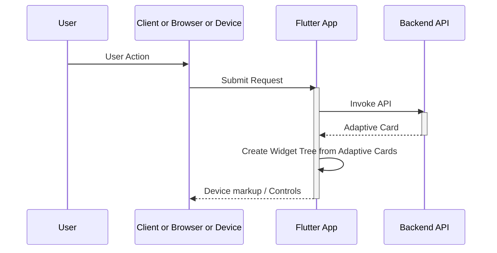

This is an Adaptive Card implementation for Flutter that has been been updated from the original by others. They did amazing work. No one appears to be doing PRs to bring it back to the original so I'm just listing the forking history below.


* [Adaptive Cards website](https://adaptivecards.io/)
* [Adaptive Cards Schema Docs](https://adaptivecards.io/explorer)
* [The main GitHub repo with samples](https://github.com/microsoft/AdaptiveCards)
  * [The v1.5 samples on the main GitHub repo](https://github.com/microsoft/AdaptiveCards/tree/main/samples/v1.5/Scenarios)
  * [Template samples. Templates are not supported in this library](https://github.com/microsoft/AdaptiveCards/tree/main/samples/Templates/Scenarios)
* [Description of Active Cards]( https://github.com/MicrosoftDocs/AdaptiveCards)
* [Another example repo containing samples/templates](https://github.com/pnp/AdaptiveCards-Templates)

The cannonical flow would be




# Execution


## Web
The web version will have a CORs issue so run it with the mobile compatible _html_ renderer.

```
cd example
flutter run -d chrome --web-renderer html --web-port 3000
```

## Emulator
```
cd example
flutter run -d chrome --web-renderer html --web-port 3000
```


# Tests
1. Test sample 2 is still failing with a rendering issue on my Windows 11 PC that I don't understand
1. I updated the golden images to match my windows machine.  It may be that they were correct for a Mac or linux machine.

# Compatibility
_to be moved to changelog probably_

This codebase has been updated to support some of the null safety requred for 3.0.0.  It works with the following version of flutter.

```
PS C:\Users\foo> flutter --version
Flutter 3.7.9 • channel unknown • unknown source
Framework • revision 62bd79521d (3 months ago) • 2023-03-30 10:59:36 -0700
Engine • revision ec975089ac
Tools • Dart 2.19.6 • DevTools 2.20.1
```
I fixed the version of Flutter while working in this repo with
```
	git checkout 3.7.9
	flutter doctor -v
```

You can find the Flutter / Dart bundling versions here: https://docs.flutter.dev/release/archive?tab=windows

## VS Code
In this repo the code is managed with VS Code.  The VS Code Flutter/Dart extension cleaned up some imports and mad other changes that have been comitted to the repository.
1. VSCode told me to enable `Developer Mode` in order to run the app

## TODO
* Add template and data json merge support
* Data merge changes - possibly related to template
  * `InitData` / `InitInput` should be rethought or replaced with templates
    * `initData` currently injected directly into a widget
    * `initInput(initData)` used to replace values. initData is a widget parameter. `initInput` is called if initData exist on component
  * `loadInput` used for choice selector lists only, at runtime, in choice set. bound by id
    * currently invoked direclty in code in handlers in sample
* Implement missing _Card Elements_
  * Add `RichTextBlock` see https://adaptivecards.io/explorer/RichTextBlock.html
  * Add `TextRun` see https://adaptivecards.io/explorer/TextRun.html
  * `MediaSource` implemented as a map in `Media`
* Implement missing _Containers_
  * Add `Table` see https://adaptivecards.io/explorer/Table.html
  * Add `TableCell` see https://adaptivecards.io/explorer/TableCell.html
  * `Fact` implemented as a map in `FactSet`
* Implement missing _Inputs_
  * `Input.Choice` implemented as a map in `ChoiceSet`
* Implement missing _Actions_
  * Add `ToggleVisibility` - currently implemented as `no-op`
  * `Action.Execute` and `Action.Submit` are currently the same via dispatch. Their behavior should possibly be different

## Changes
2023 06
* Updated where nulls were used by Flutter is now null safe.
* Picked a default with for text entry that may be wrong or differ from the old default.
* Just did the dumb fix for mockito mocking with null safety.
* Test images updated for windows
* Image URLs updated to their new homes.  Some old sites were migrated or taken down
* Minor changes to use Material in one config file because VS Code warned about it
* Pulled the neohelden logos from the main page in the example. Neohelden has dropped all references from their website and deleted their repository. Had the extra advantage of shrinking the image.
* Refactored example to use common driver page for most of the samples.  Remolved the single purpose drivers
* Now have a couple samples that pull from adaptivecards.io github repo
* lab.dart can now run against any adaptive card local or remote.  See [example readme](example/README.md)
* used VS Code plugin `dart import` to organize imports
* android with Java 17
  * gradle upgrade from 5.6.2 to 7.4.2
  * upgraded kotlin version to 1.8.22
  * added `--add-opens=java.base/java.io=ALL-UNNAMED` to jvm args to run on Java 17 (Java 16+)

_________________________________________________________________________

# Repository History

Everything below this line is from the original README.md
The referenced GitHub repository has vanished.  Look at the forking train to figure out where the current repository was forked from or look here:

1. https://github.com/freemansoft/Flutter-AdaptiveCards Mine forked from
1. https://github.com/lannes/Flutter-AdaptiveCards forked from
1. https://github.com/juansoilan/Flutter-AdaptiveCards forked from the original
1. https://github.com/rodydavis/Flutter-AdaptiveCards the original but possibly from the no longer here repo
1. https://github.com/neohelden/Flutter-AdaptiveCards


___________________________________________________________________________


# Adaptive Cards for Flutter

We decided to build a Flutter implementation of Adaptive Cards because we believe in the future of both technologies. With Flutter, we found an exciting framework for ultra-fast and cross-platform UI development. And with Adaptive Cards, we can combine that with an industry standard for exchanging card content in a structured way. At Neohelden, we're building on both of these technologies with our AI-assistant for business – and you can learn more about why we built this in our [blog-post on the release of our Adaptive Cards in Flutter library](https://neohelden.com/blog/tech/using-adaptive-cards-in-flutter/).

### Installing

Add this to your package's pubspec.yaml file:

```yml
dependencies:
  flutter_adaptive_cards: ^0.1.2
```

```dart
import 'package:flutter_adaptive_cards/flutter_adaptive_cards.dart';
```

## Using

Using Adaptive Cards in Flutter coudn't be simpler: All you need is the `AdaptiveCard` widget.

### :warning: Markdown support vs. ColumnSet content alignment

Due to [issue #171](https://github.com/flutter/flutter_markdown/issues/171) of the Flutter Markdown package, the flag `supportMarkdown` was introduced to all Adaptive Card contractors. The default value of this property is `true`, to stay compatible with older versions of this package, which didn't support content alignment in ColumnSets. If the value is set to `false` the content alignment in ColumnSets is working accordingly, but every TextBlock is displayed without Markdown rendering. As soon if the issue is resolved this flag will be removed.

### Loading an AdaptiveCard

There are several constructors which handle loading of the AC from different sources.
`AdaptiveCard.network` takes a url to download the payload and display it.
`AdaptiveCard.asset` takes an asset path to load the payload from the local data.
`AdaptiveCard.memory` takes a map (which can be obtained but decoding a string using the json class) and displays it.

### HostConfig

The `HostConfig` can be configured via two parameters of every constructor:

1. The parameter `hostConfigPath` takes a static HostConfig which can be stored as a local asset. In this case, the [HostConfig has to be added to the pubspec.yaml](https://flutter.dev/docs/development/ui/assets-and-images) of the project.
2. The parameter `hostConfig` takes a dynamic HostConfig as a String. This can easily be programmaticly and can e.g. be used for switching between a light and a dark theme.

If both parameters are set the `hostConfig`parameter will be used.

### Example

```dart
AdaptiveCard.network(
  placeholder: Text("Loading, please wait"),
  url: "www.someUrlThatPoints.To/A.json",
  hostConfigPath: "assets/host_config.json",
  onSubmit: (map) {
    // Send to server or handle locally
  },
  onOpenUrl: (url) {
    // Open url using the browser or handle differently
  },
  // If this is set, a button will appear next to each adaptive card which when clicked shows the payload.
  // NOTE: this will only be shown in debug mode, this attribute does change nothing for realease builds.
  // This is very useful for debugging purposes
  showDebugJson: true,
  // If you have not implemented explicit dark theme, Adaptive Cards will try to approximate its colors to match the dark theme
  // so the contrast and color meaning stays the same.
  // Turn this off, if you want to have full control over the colors when using the dark theme.
  // NOTE: This is currently still under development
  approximateDarkThemeColors: true,
);
```

## Example App

We try to show every possible configuration parameter supported by the AdaptiveCards components in the example app of this repository. If we missed any, please feel free to open an issue.

## Running the tests

```sh
flutter test
```

and to update the golden files run

```sh
flutter test --update-goldens test/sample_golden_test.dart
```

This updates the golden files for the sample cards. Depending on your operating system you might have issues with the font rendering. For the CI / CD setup you need to generate the golden files using a Docker container:

```
# run the following command in the root folder of this project
docker run -it -v `pwd`:/app cirrusci/flutter:dev bash

# and inside the container execute
cd /app
flutter test --update-goldens

# afterwards commit the freshly generated sample files (after checking them)
```

## Contributing

Please read [CONTRIBUTING.md](https://gist.github.com/PurpleBooth/b24679402957c63ec426) for details on our code of conduct, and the process for submitting pull requests to us.

## Authors

- **Norbert Kozsir** (@Norbert515) – _Initial work_, Former Head of Flutter development at Neohelden GmbH
- **Pascal Stech** (@Curvel) – _Maintainer_, Flutter Developer at Neohelden GmbH (NeoSEALs team)
- **Maik Hummel** (@Beevelop) – _Maintainer_, CTO at Neohelden GmbH (Daddy of the NeoSEALs team)

See also the list of [contributors](https://github.com/neohelden/flutter_adaptive_cards/contributors) who participated in this project.

## License

This project is licensed under the MIT License - see the [LICENSE](LICENSE) file for details.
