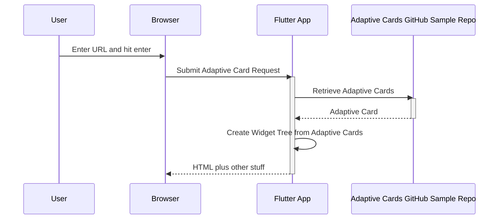

# AdaptiveCards example application example

This should demonstrate various card examples sourcing the AdaptiveCard markup from both local and remote sources.

## Getting Started

For help getting started with Flutter, view Flutter's online
[documentation](https://flutter.io/).

## Example Execution

These instructions assume you are exercising the web and run in mobile device mode to ignore CORS

### main.dart - the main example

A demo with over a dozen different adaptive cards that can be activated by clicking on them in the main window.

`main.dart` is the default so it doesn't need to be passed as `-t` parameter

### main.dart Web

### Web

The web version will have a CORs issue so run it with the mobile compatible _html_ renderer.

```zsh
cd example
flutter run -d chrome --web-renderer html --web-port 3000
```

### main.dart Mobile Device Emulator

If you had a mobile device named `emulator-555`

```zsh
cd example
flutter run -d emulator-555
```

### registry.dart Web

< insert purpose here>

```zsh
cd example
flutter run -t lib/registry.dart -d chrome --web-renderer html --web-port 3000
```

### lab_web.dart Web

Displays an Adaptive card that is loaded via a URL. Specify the URL by entering or pasting into a text field on the page.  Intended as a debugging tool

```zsh
cd example
flutter run  lib/lab_web.dart -d chrome --web-renderer html --web-port 3000
```

### lab_web.dart with a Mobile device emulator

```zsh
cd example
flutter run lib/lab_web.dart -d <emulator name>
```

Ex: an Android Emulator named `emulator-555`

```zsh
cd example
flutter run lib/lab_web.dart -d emulator-555
```

`lab_web.dart` executes using this sequenece.



### lab.dart

Displays an adaptive cardthat you specify a asset location as a command line argument. This only works with local Adaptive Card JSON resources. Intended as a debugging tool

This snippet assumes you want to test the adaptive card activity_update located in the example's lib directory.

```
cd example
flutter run  --dart-define=url=lib/activity_update lib/lab.dart -d chrome --web-renderer html
```

## Open Items

* `Network via Assets` works in web but not in Android mobile. There is some layout issue.
* Add ability to set `debugDefaultTargetPlatformOverride = TargetPlatform.fuchsia` as command line override in examples instead of hard coding
* Changing from light to dark mode erases any selected data - noticiable in `Input` examples

## Changelog

2023 07

* Added text selection enablement in the main examples.
* Made null safe for Flutter > 3.7.0
* migrated example from `DynamicTheme` to <https://rydmike.com/colorscheme> <https://rydmike.com/colorpicker>
  * <https://github.com/rydmike/flex_color_scheme> to get a better feel theme and color possibilities
* Added text selection enablement in the examples.
* example about pane is injected modal panel
* Removed `fuscia` target platform overrides in examples

2023 06

* Pulled the neohelden logos from the main page in the example. Neohelden has dropped all references from their website and deleted their repository. Had the extra advantage of shrinking the image.
* Refactored example to use common driver page for most of the samples.  Remolved the single purpose drivers
* Now have a couple samples that pull from adaptivecards.io github repo
* lab.dart can now run against any adaptive card local or remote.  See [example readme](example/README.md)
