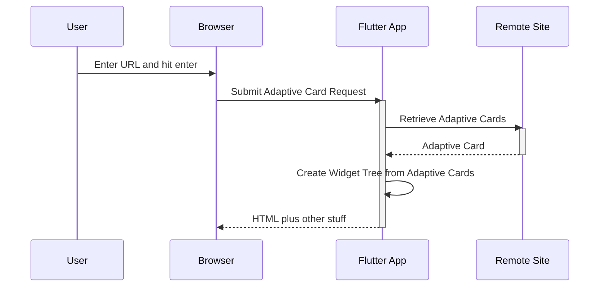

# AdaptiveCards example application example

This should demonstrate all the cards, local and remote sources for AdaptiveCards

## Getting Started

For help getting started with Flutter, view our online
[documentation](https://flutter.io/).


## Usage
These instructions assume you are exercising the web and run in mobile device mode to ignore CORS

### the demo

A demo with several different adaptive cards that can be activated by clicking on them in the main window.
Main.dart is the default so it doesn't need to be passed as `-t` parameter
```
cd example
flutter run -d chrome --web-renderer html
```

### registry.dart
```
cd example
flutter run -t lib/registry.dart -d chrome --web-renderer html
```

### lab_web.dart
Displays an adaptive card. Lets you specify the URL by pasting into a text field on the page.  Intended as a debugging tool

```
cd example
flutter run  lib/lab_web.dart -d chrome --web-renderer html
```




### lab.dart
Displays an adaptive card. Lets you specify a relative file location as a command line argument.  Intended as a debugging tool

This snippet assumes you want to test the adaptive card activity_update located in the example's lib directory.
```
cd example
flutter run  --dart-define=url=lib/activity_update lib/lab.dart -d chrome --web-renderer html
```

# Open Items

* `GenericListPage` doesn't support enable/disable markdown. Fixing this could get rid of more of the sample page drivers