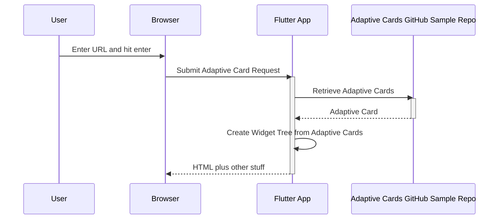

# AdaptiveCards example application example

This should demonstrate various card examples sourcing the AdaptiveCard markup from both local and remote sources.

## Getting Started

For help getting started with Flutter, view Flutter's online
[documentation](https://flutter.io/).


## Example Execution
These instructions assume you are exercising the web and run in mobile device mode to ignore CORS

### main.dart

A demo with over a dozen different adaptive cards that can be activated by clicking on them in the main window.
* Main.dart is the default so it doesn't need to be passed as `-t` parameter

```
cd example
flutter run -d chrome --web-renderer html --web-port 3000
```

### registry.dart
< insert purpose here>

```
cd example
flutter run -t lib/registry.dart -d chrome --web-renderer html --web-port 3000
```

### lab_web.dart
Displays an Adaptive card that is loaded via a URL. Specify the URL by entering or pasting into a text field on the page.  Intended as a debugging tool

```
cd example
flutter run  lib/lab_web.dart -d chrome --web-renderer html --web-port 3000
```

or for a mobile device emulator
```
cd example
flutter run lib/lab_web.dart -d <emulator name>
```

Ex: an Android Emulator named `emulator-555`
```
cd example
flutter run lib/lab_web.dart -d emulator-555
```

`lab_web.dart` executes using this sequenece.



### lab.dart
Displays an adaptive cardthat you specify a asset location as a command line argument. This only works with local Adaptive Card JSON resources. Intended as a debugging tool

This snippet assumes you want to test the adaptive card activity_update located in the example's lib directory.
```
cd example
flutter run  --dart-define=url=lib/activity_update lib/lab.dart -d chrome --web-renderer html
```

# Open Items

* `Network via Assets` works in web but not in Android mobile. There is some layout issue.

